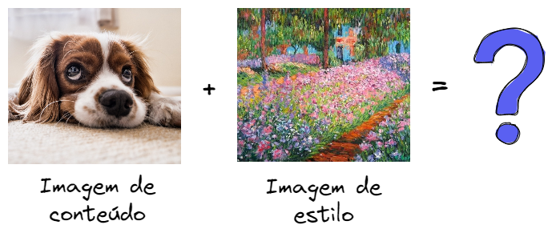

## :page_facing_up: Sobre este trabalho

Este trabalho foi resultado de vários estudos realizados na área de Inteligência artificial e Transfer Learning com o objetivo de, a partir de uma imagem de conteúdo e uma imagem de estilo, fazer uma combinação e gerar uma nova imagem artística. Para isso, foram utilizados conhecimentos das bibliotecas Keras e Tensorflow, com a criação de tensores e aplicação do Transfer Learning com o modelo pré-treinado VGG-16.

