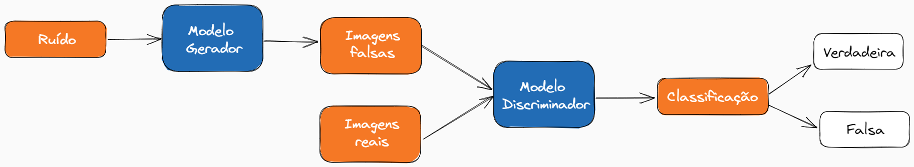

## :page_facing_up:Sobre este trabalho

Este trabalho foi adaptado de um projeto encontrado no [Kaggle](https://www.kaggle.com/general/247477), produzido por Ishan Kotian. Este tem como objetivo entender e explorar na prática as Redes Adversárias Generativas (GAN), uma nova prática de deep learning bem recente na literatura.

## :bulb: Redes Adversárias Generativas

Este tipo de rede neural constitui, na verdade, duas redes neurais, podendo ser redes neurais perceptron múltiplas camadas ou redes neurais convolucionais. Elas são treinadas uma contra a outra, de forma que existe um gerador e um discriminador. 

Este tipo de treinamento tem como objetivo, por exemplo, identificar se uma imagem é verdadeira ou falsa, de modo que uma das redes será responsável por criar imagens que se parecem com imagens reais (__modelo gerador__), e a outra rede será responsável por classificar as imagens como verdadeiras ou falsas (__modelo discriminador__).

Abaixo, encontra-se o esquema de funcionamento de redes adversárias generativas:

Em geral, quando o modelo discriminador está sendo treinado, o modelo gerador deve ser congelado e deve apenas retropropagar os erros para atualizar apenas o discriminador, e o mesmo ocorre na situação inversa. Deve-se para o treinamento quando o equilíbrio de Nash é atingido, ou seja, quando as imagens geradas parecem quase imagens reais.

## :tshirt: Aplicação: dataset fashion_mnist

A aplicação tem como objetivo utilizar o dataset fashion_mnist do Keras, que contém 70.000 imagens de roupas. Essas imagens possuem tamanho 28x28 em tons de cinza, e são associadas a um rótulo de 10 classes diferentes.

Assim, a partir das imagens reais, serão geradas novas imagens falsas pelo modelo gerador (a partir da introdução de um ruído nas imagens), enquanto o modelo discriminador deverá realizar corretamente a classificação das imagens como verdadeiras ou falsas.
