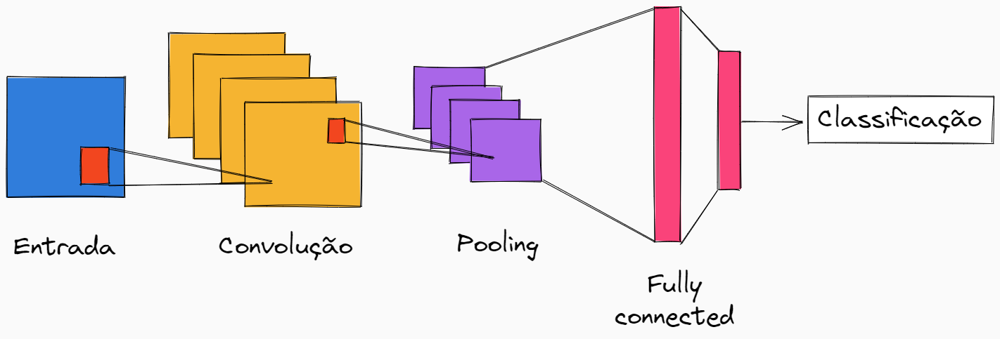

## :page_facing_up: Sobre este trabalho

Este trabalho foi adaptado de um projeto encontrado no [Kaggle](https://www.kaggle.com/code/davinsthomas/cnn-adaptive-aug-template), produzido por Davin S. Thomas, e tem como objetivo explorar uma aplicação prática de redes neurais. Para esse contexto, escolheu-se uma aplicação de classificação de imagens usando redes neurais convolucionais (CNN).

## :bulb: Redes Neurais Convolucionais

As redes neurais convolucionais são muito utilizadas em aplicações onde os dados de entrada são bidimensionais, especialmente, para a classificação de imagens. A primeira rede convolucional de sucesso foi desenvolvida por Yann LeCun em 1988 e desde então vem sendo amplamente estudada e tendo diferentes arquiteturas implementadas (cada vez melhores) ao longo dos anos.

Em geral, esse tipo de rede neural é composto por 3 etapas principais:

1. __Convolução__: nessa camada, são aplicados diversos filtros que realizam a operação matemática da convolução nos dados;
2. __Pooling__: esta etapa tem como objetivo simplificar as informações vindas da cama anterior, diminuindo bastante o tamanho dos dados;
3. __Fully connected__: após realizar as operações de convolução e pooling desejadas, a última etapa é uma rede perceptron de múltiplas camadas, sendo o final da rede convolucional.

A imagem abaixo mostra um exemplo do passo a passo de uma rede neural convolucional

## :fist: Aplicação: Linguagem Brasileira de Sinais

A aplicação tem como objetivo identificar a qual letra uma imagem corresponde na Língua Brasileira de Sinais (Libras). Assim, para essa aplicação, utilizou-se um dataset do Kaggle com aproximadamente 86 mil imagens, categorizadas em 29 classes: as 26 letras do alfabeto e outros três símbolos comuns em libras: _del_, _nothing_ e _space_.

A imagem abaixo ilustra os símbolos de cada letra do alfabeto em libras:

